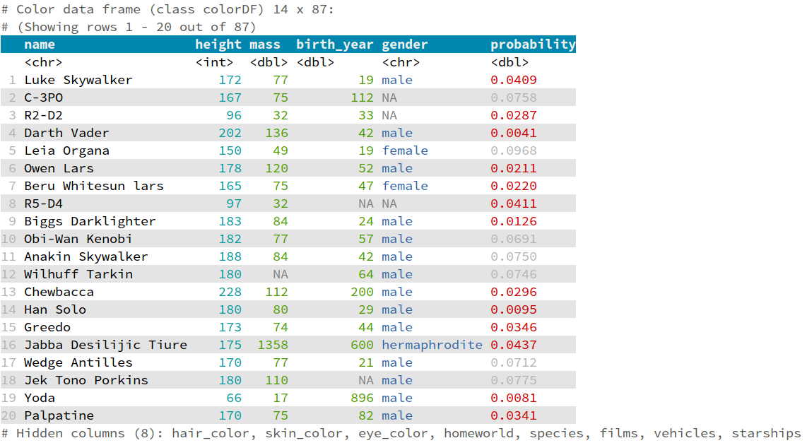

# colorDF - Colored table output in R terminal

The package makes it easy to get nice, colored tables in R terminal.



## Installation

From github:

```
library(devtools)
install_github("https://github.com/january3/colorDF")
```

