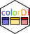

# colorDF <a href="https://january3.github.io/colorDF/"></a>

## Colored table output in R terminal

<!-- badges: start -->
[](https://github.com/january3/colorDF/actions/workflows/R-CMD-check.yaml)
[](https://github.com/january3/colorDF/actions/workflows/test-coverage.yaml)
[](https://CRAN.R-project.org/package=colorDF)
<!-- badges: end -->


The package makes it easy to get nice, colored tables in R terminal.


## Installation

From github:

```
library(devtools)
install_github("https://github.com/january3/colorDF")
```

